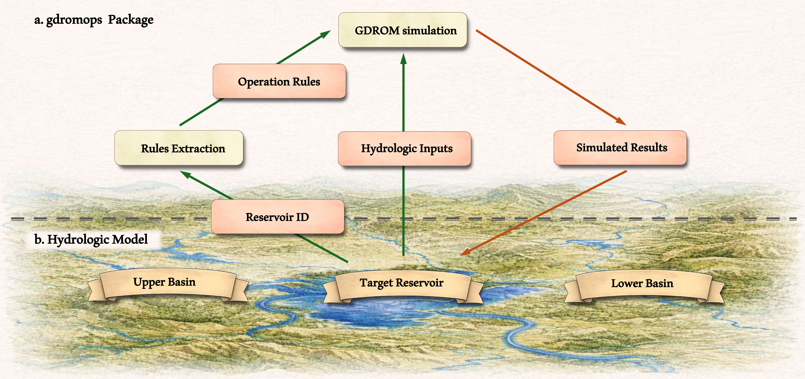
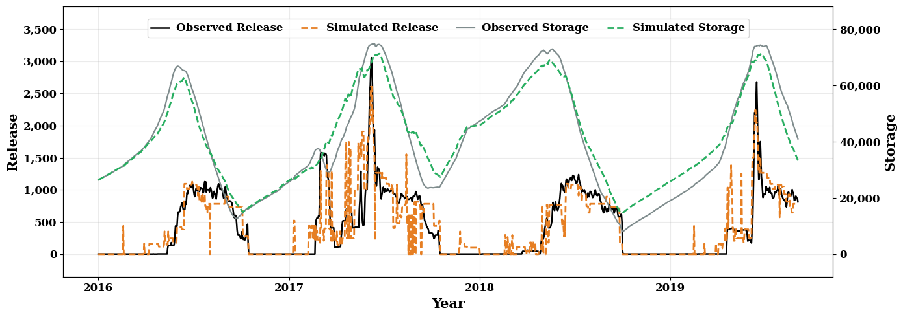

# Summary

Realistic representation of reservoir operations is essential for accurate hydrologic simulation and effective water resources management [@Hanasaki2006Reservoir]. However, due to data limitations and complexity, most hydrologic models rely on simplified or unrealistic reservoir representations, leading to substantial uncertainties and biases in model parameterization and streamflow simulation [@Vora2024Coupling]. To address this limitation, we present gdromops, a python package designed to serve as a reproducible, open-source, and lightweight inference engine for applying these pre-trained GDROM rules. The package currently supports simulations for 2,017 reservoirs across the Contiguous United States (CONUS) [@Zheng2025GDROMv2]. Specifically, gdromops automates the operation rule loading, release simulation, and storage state updating. The gdromops package can function as a standalone simulation engine for reservoir simulation, providing a quick and reproducible tool for historical analysis and scenario testing. Alternatively, it can be embedded within large-scale routing frameworks, allowing users to replace simplified operation rules with more realistic GDROM rules.

# Statement of need

Reservoir operation serves multiple water management purposes such as water supply, flood control, hydropower generation, recreation, and navigation, while it also poses a major human interference to hydrologic processes by altering the streamflow regime. Realistic representation of reservoir operations is therefore essential for accurate hydrologic simulation and effective water resources management. However, the lack of details regarding real-world reservoir operations has impeded the development of a generic reservoir model. As a result, current large-scale hydrologic models go with unrealistic reservoir operation models and end with uncertainties and errors in model parametrization and simulation [@Vora2024Coupling]. For example, reservoir routing in the U.S. National Water Model (NWM) relies on simplified approaches, such as level-pool routing or prescribed operation curves, which limit its ability to realistically simulate regulated releases and storage dynamics [@Cosgrove2024NWM]. 

To resolve the situation stated above, Generic Data-Driven Reservoir Operation Models (GDROMs) were developed to derive realistic and highly reproducible operation rules from historical records across the Contiguous United States (CONUS). GDROMs were first developed for 452 large reservoirs [@Chen2022GDROM] and then expanded to 2,017 reservoirs [@Zheng2025GDROMv2], covering nearly all reservoirs with a surface area larger than 1 km2. The operation rules derived by GDROMs are accurate, interpretable, and computationally lightweight, making them well suited for direct integration into large-scale hydrologic models. However, despite these advantages, practical use of GDROM rules remains challenging. The rules are distributed primarily as model-specific artifacts and require manual loading, preprocessing, and custom implementation, which creates a substantial barrier for users who are not closely familiar with the original GDROM framework.

To facilitate broad accessibility and seamless coupling of GDROMs with large-scale hydrologic models, we developed gdromops, an open-source Python package that operationalizes pre-trained GDROM rules as a lightweight and reproducible inference engine. The package encapsulates all pre-trained operation rules and provides a standardized, plug-and-play interface that can be directly embedded into existing hydrologic modeling workflows, without the need for manual rule handling or external data retrieval. By serving as a software bridge between data-driven reservoir models and hydrologic routing frameworks (e.g., NWM), gdromops enables efficient and scalable incorporation of realistic reservoir operations, improving the simulation of regulated streamflow and reservoir storage dynamics. 

# Overview of gdromops

The workflow of gdromops is straightforward, as illustrated in \autoref{fig:workflow}a. Users begin by specifying a target reservoir using its unique identifier (e.g., GRanD_ID = "449" for Echo Reservoir) [@Lehner2011GRAND]. The package automatically retrieves the GDROM rule set associated with the specified reservoir ID. Users then prepare the necessary hydrologic inputs, which include the required inflow time series and either an initial storage value or a full observed storage time series, as well as a local weather indicator (i.e., Palmer Drought Severity Indicator – PDSI) [@NOAAPSL2024PDSI].  The core function GDROM simulation combines the operation rules with the user's hydrologic inputs to perform the simulation. Depending on the mode:
•	If observed storage time series are provided, the function simulates the release time series.
•	If only an initial storage value is provided, the function simulates reservoir releases sequentially at each time step and updates storage using the mass-balance equation, with the updated storage carried forward to the next step.

\autoref{fig:workflow}b further illustrates how gdromops is integrated with a hydrologic modeling framework. Within frameworks such as T-Route [@NOAAOWP2023TRoute] or NWM [@Cosgrove2024NWM], each reservoir node can invoke gdromops with inflows from upper region and current storage states of the reservoir to compute releases for downstream propagation. Through this modular exchange, original simplified reservoir operation rules will be replaced by GDROM rules, enabling more accurate and dynamically consistent interactions between the reservoir and the surrounding river-network system. Since GDROM rules are pre-trained and stored externally to the hydrologic model, the same gdromops interface can be applied repeatedly across large ensembles of reservoirs without re-parameterizing the routing model itself. In addition, to accommodate hydrologic models with different temporal resolutions, gdromops supports variable-timestep simulation, which generalizes GDROM behavior to sub-daily inflow data by internally harmonizing timestep units. 

# Study case

\autoref{fig:example} provides an example application of gdromops for multi-day simulation with an initial storage, showing observed and simulated release and storage for Echo Reservoir (GRanD_ID = “449”). The example demonstrates how GDROM rules can reproduce day-to-day reservoir operating behavior even when only partial or limited input data are available. Together, these simulation modes ensure that gdromops can be applied across a wide range of hydrologic settings, enabling robust and reproducible reservoir simulations under both data-rich and data-sparse conditions.

# Acknowledgements

This data product was supported by the Cooperative Institute for Research to Operations in Hydrology (CIROH) with funding under award NA22NWS4320003 from the NOAA Cooperative Institute Program. The statements, findings, conclusions, and recommendations are those of the author(s) and do not necessarily reflect the opinions of NOAA. 

# References
